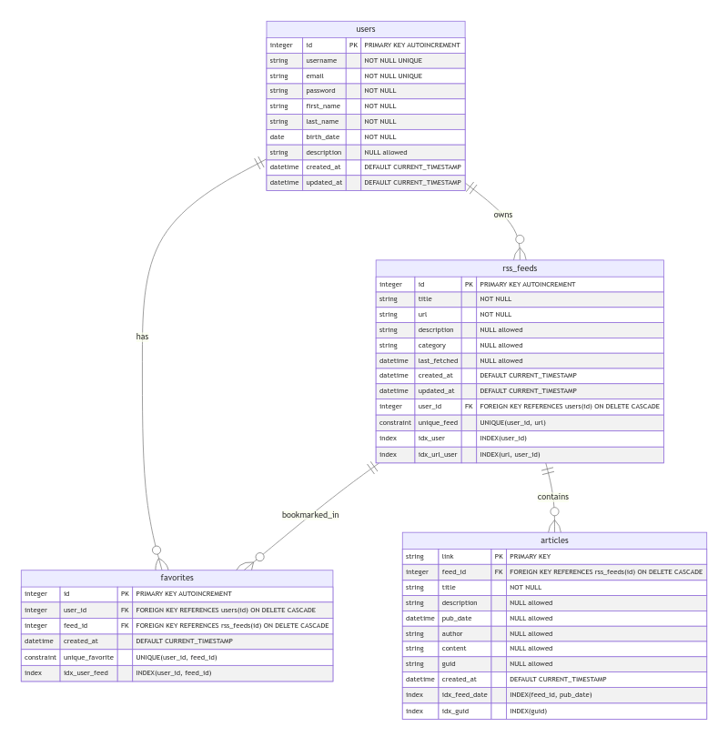

*Robin HILAIRE - TP2 FA*

# 📰 RSS Feed API

A robust REST API for managing RSS feeds, articles, and user favorites, built with Node.js, Express, and SQLite.

## 🎯 Features

- User authentication with JWT
- RSS feed management
- Article synchronization
- Favorites system
- Full-text search capabilities
- API key protection
- Swagger documentation
- Jest unit tests and code coverage

## 🛠️ Technology Stack

- Node.js
- TypeScript
- Express.js
- SQLite
- JWT for authentication
- Swagger/OpenAPI for documentation
- Jest for testing

## 🚀 Getting Started

### Prerequisites

- Node.js (v18 or higher)
- npm or yarn

*or*

- Docker / Docker XC

### Installation

Clone the repository:

```bash
git clone https://github.com/RobinHil/api-rest-project.git
cd api-rest-project
```

#### If running with npm

1. Install dependencies:

```bash
npm install
```

2. Configure environment variables (create a `.env` file):

```env
JWT_ACCESS_SECRET=your-access-secret-key
JWT_REFRESH_SECRET=your-refresh-secret-key
SYSTEM_API_KEY=your-secret-system-api-key
```

3. Initialize the database:

```bash
npm run init-db
```

## 🏃‍♂️ Running the Application

### Development Mode

```bash
npm run dev
```

### Production Mode

```bash
npm run build
npm start
```

### Using Docker Compose

1. Update `.env` file or `docker-compose.yml` to set environment variables:

```env
NODE_ENV=env_mode (development or production)
JWT_ACCESS_SECRET=your_secure_access_secret
JWT_REFRESH_SECRET=your_secure_refresh_secret
SYSTEM_API_KEY=your_secure_system_api_key
```

2. Build image and run Docker Compose file:

```bash
docker compose up -d --build
```

The server will start on port 3000 by default. Access:

- API welcome page: [http://localhost:3000](http://localhost:3000) ou [http://localhost:3000/api](http://localhost:3000/api)
- API documentation: [http://localhost:3000/api/docs](http://localhost:3000/api/docs)

## 🔑 Authentication

The API uses two levels of authentication:

1. API Key: Required for all `/api` routes (header: `X-API-Key`)
2. JWT Token: Required for protected routes (header: `Authorization: Bearer <token>`)

### Getting Started with Authentication

1. Register a new user:

```bash
curl -X POST http://localhost:3000/api/auth/register \
  -H "X-API-Key: your-api-key" \
  -H "Content-Type: application/json" \
  -d '{"username": "user", "email": "user@example.com", "password": "password"}'
```

2. Login to get tokens:

```bash
curl -X POST http://localhost:3000/api/auth/login \
  -H "X-API-Key: your-api-key" \
  -H "Content-Type: application/json" \
  -d '{"email": "user@example.com", "password": "password"}'
```

3. Refresh tokens:

```bash
curl -X POST http://localhost:3000/api/auth/refresh \
  -H "X-API-Key: your-api-key" \
  -H "Content-Type: application/json" \
  -d '{"refreshToken": "string"}'
```

## 📚 API Documentation

Full API documentation is available at `/api/docs` using Swagger UI. Main endpoints include:

### Public Endpoints

- `GET /` or `GET /api` - Welcome message and API info
- `GET /api/docs` - Swagger documentation

### Authentication Endpoints

- `POST /api/auth/register` - Register new user
- `POST /api/auth/login` - User login
- `POST /api/auth/refresh` - Refresh access token

### Protected Endpoints

- Users
  - `GET /api/users/me` - Get current user profile
  - `PUT /api/users/me` - Update user profile
  - `DELETE /api/users/me` - Delete user account

- RSS Feeds
  - `GET /api/feeds` - List all feeds
  - `POST /api/feeds` - Create new feed
  - `GET /api/feeds/{id}` - Get feed details
  - `PUT /api/feeds/{id}` - Update feed
  - `DELETE /api/feeds/{id}` - Delete feed

- Articles
  - `GET /api/feeds/{feedId}/articles` - List feed articles
  - `GET /api/articles` - List all articles
  - `GET /api/articles/{link}` - Get article details

- Favorites
  - `GET /api/favorites` - List user favorites
  - `POST /api/favorites` - Add feed to favorites
  - `DELETE /api/favorites/{feedId}` - Remove from favorites

- Search
  - `GET /api/search/feeds` - Search feeds
  - `GET /api/search/articles` - Search articles
  - `GET /api/search/favorites` - Search in favorites

## 🔄 Synchronization

The API includes an automatic feed synchronization system:

- Manual sync per feed: `POST /api/feeds/{feedId}/sync`
- System-wide sync: `POST /api/system/sync` (requires system API key)

## 🧪 Testing

Run the test suite:

```bash
npm test
```

*or*

```bash
npm run test
```

Get tests JUnit report:

```bash
npm run test:junit
```

Run the test suite with code coverage report:

```bash
npm run test:coverage
```

## 📦 Database Structure

The application uses SQLite with the following schema:



Main tables:

- `users` - User accounts management
- `rss_feeds` - RSS feed information and metadata
- `articles` - Feed articles content and metadata
- `favorites` - User-Feed relationships for bookmarking

## 🔒 Security Features

- Password hashing with bcrypt
- JWT token-based authentication
- API key requirement
- Input validation
- SQL injection protection

## 👥 Authors

- HILAIRE Robin
